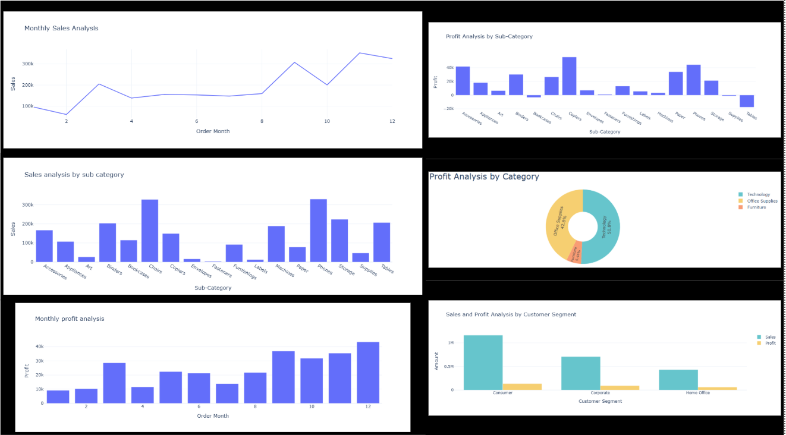

# 🛒 E-Commerce Sales Analysis Project

This project focuses on analyzing e-commerce sales data to uncover business insights, identify trends, and improve decision-making through data visualization and metrics. Built using **Power BI**, this interactive dashboard provides a comprehensive overview of sales, returns, profits, and customer behavior across various categories.

---

## 📊 Dashboard Features

- **Sales Overview**: Total sales, profit, and quantity sold
- **Top Performing Products**: Highest revenue-generating items
- **Category-wise Analysis**: Compare performance across different product categories
- **Customer Trends**: Region-wise and segment-wise customer behavior
- **Returns Insights**: Identify high-return items and patterns
- **Monthly Trend Analysis**: Seasonal patterns and growth rates

---

## 📌 Key Highlights

- Created interactive dashboards using **Python with Libraries**
- Enabled **slicer filters** for dynamic analysis
- Improved visibility into business performance across regions and categories

---

## 🧰 Tools & Technologies
- **Python**
- **Statistic**
- **Excel**
- **Data Cleaning & Transformation**

---

## 📞 Contact

If you want to collaborate or have any feedback, feel free to connect with me:

- 📧 Email: [amrmuzaffar46@gmail.com](mailto:amrmuzaffar46@gmail.com)  
- 💼 LinkedIn: [Muzaffar on LinkedIn](https://www.linkedin.com/in/muzaffar-muzammil-242b37323)

---

## 📷 Sample Dashboard Preview

